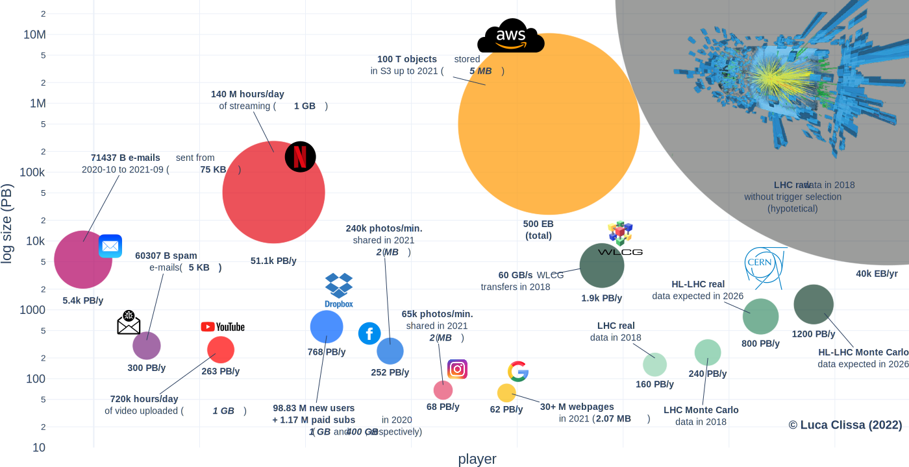

# Big Data production 2021
This repository collects the latest data (2021) of Big Data production for the main big data players from industry and academy (`BigData_sizes.csv`).  
Some reasonable *guesstimates* of the corresponding orders of magnitude are then reconstructed based on i) the amount of contents produced by each stakeholder and ii) their unitary size. For more information please refer to [Survey of Big Data sizes in 2021](https://arxiv.org/abs/2202.07659).

The results are summarized in a bubble plot (interactive version [here](https://clissa.github.io/BigData2021/BigData2021.html)):

The code to reproduce the visualization is reported in the `Big Data players.ipynb` notebook.
